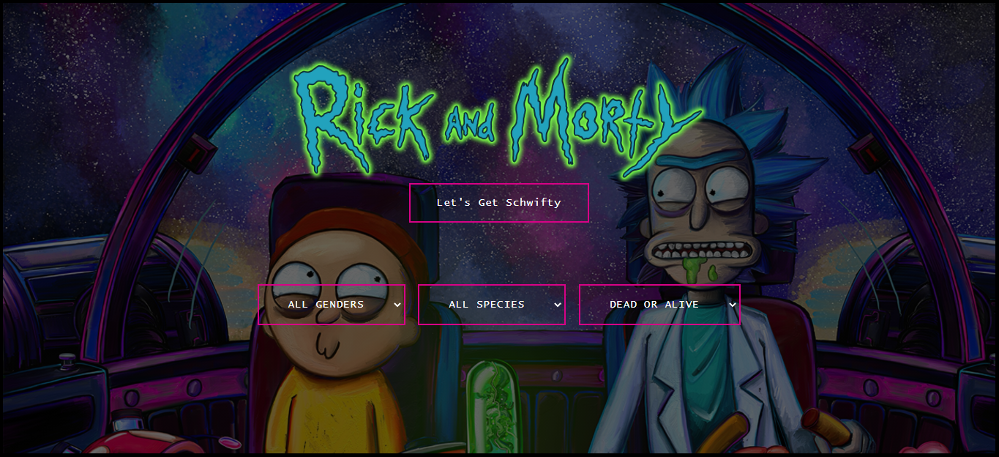

# Rick And Morty Seach API Project

This is a small Rick and Morty project that helps its users learn more about their favourite characters. The API used for this project was the Rick and Morty API (https://rickandmortyapi.com/). The splash page has a button that gets schwifty and displays all characters. The display page shows the images of the characters and users can click on the images to get their details. 

The splash page allows us to filter characters by their species, gender and status (i.e. if they are dead or alive).

Wins - 
- Really like the look and feel of the splash page. 
- Getting the buttons and filter to work.
- Displaying character images on cards and then replacing that with the details on click.

Challenges - 
- Having a translucent background image for the splash page. 
- Getting all the buttons to work at the same time. Most occasions when I would add one functionality, the previous one would stop working or start having bugs!

Incomplete Work/ Future Work -
- Right now a maximum of 20 characters are displayed. Want to add the option to increase that and/or have multiple pages
- Splash page only works desktop version and not woth mobile version. 
